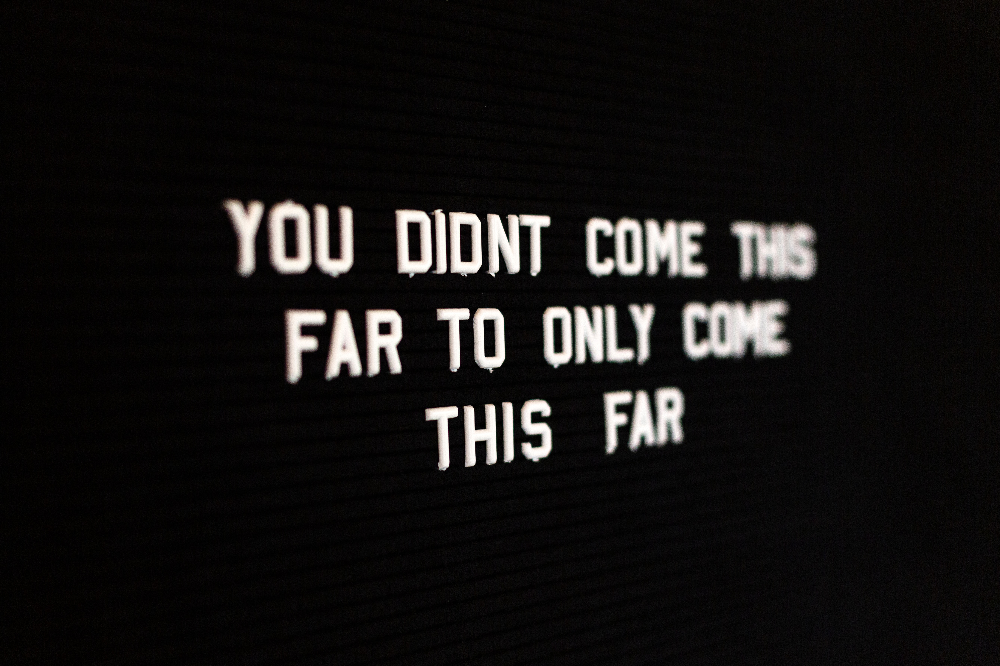

_Photo by [Drew Beamer](https://unsplash.com/@drew\_beamer) on [Unsplash](https://unsplash.com/collections/2324987/no-excuses)_

This was supposed to be a mid-year recap but I honestly don’t have much to share. I haven’t really made progress on any of the goals that I set for myself at the beginning of the year. It’s not that I don’t want to. Far from it. I wouldn’t have made the goals I did if I didn’t want to achieve them. I _really do_ want them to come to fruition.

So what happened? Well … we had just bought a house last year and that means that our expenses have increased so it’s been really hard to find the money to pay off our debts. We have been so busy with the theatre and superhero things that I haven’t had the time to just sit down and write my book. Along with the busyness comes late nights and that makes it really hard to get up in the morning to workout, which leads to rushed meals and just eating whatever I can rather than planning out good meals to eat. The list goes on ...

## Blah, Blah, Blah

I have a lot of excuses, don’t I? Let’s be honest, we all do. I’d wager that for a lot of us, whenever we fail, that is our go-to thing to do.

It’s someone else’s fault. It’s the circumstances of our lives. We didn’t succeed because of this, that, or the other thing.

Excuses are just a way of shifting the focus of attention for something undesirable onto someone or something else.

We jump to excuses immediately because we don’t like the feeling of failure. We don’t like it when we let other people (or even ourselves) down. We find it easier on our own hearts to put the blame somewhere other than where it needs to be.

Why? Because then we won’t be the one that’s in trouble. Excuses are easy. Excuses make us feel better about ourselves.

Excuses are poison.

## What is the Truth?

Here’s the thing about excuses: excuses are almost always _not_ the truth.

The truth is that although I want to succeed with my goals, I haven’t made the time or put forth the effort it would take to make them happen. They are hard goals and they require sacrifices I have been unwilling to make up until this point.

The truth is that I haven’t made my goals a priority. I haven’t put my goals on my calendar with a deadline. I haven’t placed them in front of me so that I can see them on a regular basis.

The truth is that my lack of success, my failure, is my responsibility. It’s not my circumstances. It’s not the people around me. It’s mine. It is my job to make sure my goals get met. It is my job to make the necessary arrangements in time, money, and effort to make them a reality.

## So What Now?

Now I’m left with a decision. When I’ve removed the excuses and owned up to the fact that I own the responsibility for my actions (or inactions), all that’s left for me to do is to make a decision. I can either decide that the things I thought were important to me are no longer important and I can let them go, _or_ I can decide that these things really are important, that I really want to accomplish them, and that it’s time to get to work. That’s it. It’s the only thing left.

I want to choose to get to work. Like I said earlier, I wouldn’t have set the goals if they weren’t important.

This means that if I want to get out of debt then I need to determine how much debt I have and what I can do to pay it all back. I’ve got to figure out where I can cut back on my lifestyle. I’ve got to determine where I need to make more money.

If I want to really write a book then I’ve got to stop playing around with watching TV or whatever it is that I do with all my time. I need to start writing … even if that means dedicating a whole day on a weekend (while still sticking to my rest schedule, of course). I need to put the time on my calendar and get to work.

No matter what it is that I want, the fact that I don’t have it is no one else’s fault but my own. The same is true for you. It’s time we all owned up to that. It’s time for us to start getting busy toward our goals.

It’s time to get to work. Anything else is just an excuse.
