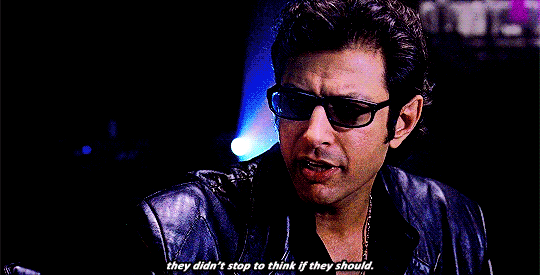

Wow … is that a “click-bait” worthy title or what? 😂

Okay, so let me start here. _The World According to Jeff Goldblum_, a show by National Geographic on Disney+, is one of my favorite new things. I’ve been a Jeff Goldblum fan for ages, ever since I saw him in _The Fly_ waaaaayyyyy back when. I’m pretty sure it’s just his personality but in this show in particular he’s quirky and insightful and makes us laugh in every episode.

Anyway, so we were watching an episode the other day where he was talking about coffee. For the record, I don’t like coffee _at all_. I love how it smells. I hate how it tastes. It smells like heaven and tastes like burnt beans. If my house smelled like it I would never leave.

Real life question: do they have a way for me to pump that smell into my house without having to actually waste coffee?

Moving on …

So he was talking about coffee and at one point he mentioned that he stopped drinking caffeine years ago.

WHAT?!?!

I don’t even know what to think about that.

Personally, I’ve been drinking caffeine for ages. You probably have too in one form or another, right? Mountain Dew has been my go to since college. I also have been drinking something called Amino Energy by Optimum Nutrition pretty much daily for the past few years. Before I moved to South Carolina I was drinking Monster Energy drinks almost exclusively. That was a bad idea for my heart. I haven’t had one of those in just about 7 years. My heart thanks me.

So anyway, I heard Jeff say that he quit drinking caffeine and was blown away. How do people function who don’t use it? What really got me though was that he said that when he stopped drinking it he felt incredibly better. Like just in general he overall felt better by not drinking it.

I began to wonder. Would my body (and life) feel better if I stopped drinking products that contained caffeine? This is a year of health for me, right? Would I be and feel healthier if I stopped?

I decided to experiment. Last Saturday was my last bit of caffeine for at least the next 30 days.

I probably should have waited until February 1st or something so that I could have a easier way of tracking or whatnot, but why not just take the bull by the horns and get after it, you know? My wonderful wife would say “Suck it up, buttercup.” Sometimes it’s just time to go. Waiting, procrastinating, just puts off the inevitable. Rip the band-aid off. I guess that is another blog post for another day though, huh?

In an effort to be completely transparent and honest - “authentic”, if you will - I only decided the whole 30 day thing while I was writing this post. I could have been done today. I could have only tried it for a couple of days. But here’s why I chose 30 days.

You know what you feel when you’ve given up the worlds most consumed stimulant? Tired, lethargic, and like your head is going to explode at any second. Well, maybe that’s just me. But as of right now, one week in, I’ve only just begun to get rid of the headaches that plague your body as you go through withdrawals. I’m just now beginning to start to feel like I might have some energy again. Like my brain is coming back to my head.

All of that plus, I didn’t really pick a great week to decide to start. We had the last week of our 21 Days of Prayer at 6:00am at church this week so getting up after 5 or 6 hours of sleep and having no caffeine to go on was kind of tough.

So I don’t really feel like I have a good handle on what my body can (and will) feel like without the caffeine coursing though it yet. I just kind of feel like 30 days should give me a pretty good grasp on that.

And who knows? I might not want to go back. That’s got to be better for me in the long haul, right?

I’ll report back in a few more weeks and let you know how things turn out!
