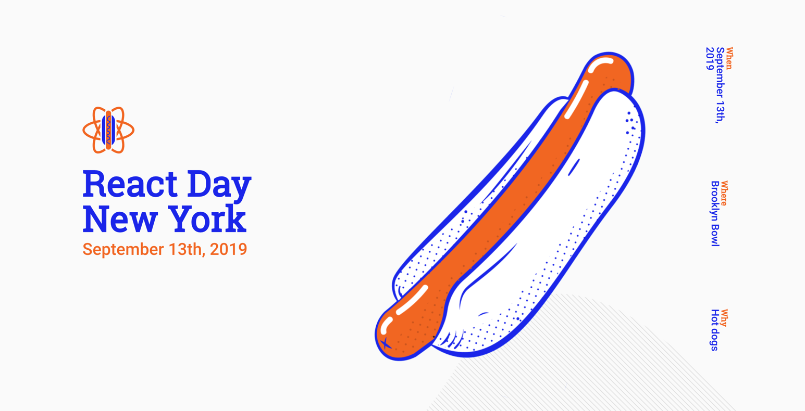

This past weekend I was fortunate enough to have been able to spend a couple days in New York and to attend React Day New York 2019 in Brooklyn. The conference was great and, having never been to New York City, the whole experience was a cultural eye-opener for me.

## Let’s Talk React

For those of you that don’t know, I work as a developer at NewSpring Church where I work mainly on our church’s mobile app. Sometime this fall we’re hoping to release a new version of our app. We’ve been working hard on this for a long time and I’m really proud of what we’re building. I believe this app has the potential to reach so many people. I can’t wait for it to be out in the world, being used by thousands of people every week.

The app that we’re building is using React Native, Apollo GraphQL, and RockCMS under the hood. In going to the React Day conference we were hoping to get some new ideas or learn some things on how we can get better at the React Native part.

I learned so much at this conference. So many business and industry leaders from large companies all across the country were there to teach what they’ve been learning in the React space.

I came away with a bunch of ideas for stuff that we could be doing that we haven’t gotten around to yet. A/B testing, React Hooks, and Code Splitting just to name a few.

But the biggest thing that I walked away from the conference knowing was that as an organization, we are actually in a really good spot right now. A lot of what the people talked about we were already doing at least as well as, if not better than, they were doing it. When the folks from the Discovery Channel give a talk about how they are solving some of the same problems we are solving, we know we’re in good company. They might have a much larger scale, but they are the same problems, and that’s exciting.

We always talk about how the church should be leading the way in our culture, and I believe that should extend to the development space as well. We are right on the edge of what people are doing with React, and that makes me feel even better about what we’re doing and the space that we’re doing it in.

## Let’s Talk New York

I’d never been to NYC. I’ve been to New York as in, _the state_, but before last weekend I had never been to New York _the city_. It was an experience for sure.

We took a train from the Newark airport into Penn Station pretty much right at rush hour as people were heading home for the day. The sheer number of people that were rushing to get to their trains to take them somewhere was overwhelming. So many people in such a hurry. It was honestly a little much for me.

Figuring out the subway/train system was something else that was pretty overwhelming for me. I was really thankful that I was with a couple of other guys from my team at work because on your own, that’s a pretty large thing to attempt to figure out. Which train do I take and what stop do I need to get off the train at? I suppose if I had done some research ahead of time it might not have been so crazy overwhelming. But since I didn’t, I would have been completely lost.

That being said, the whole public transportation system is awe-inspiring. The number of people that they transport through the city on a daily basis is incredible. Just think for a second about the sheer size of the whole system; the number of trains and how they keep everything moving and as close to on-time as possible. It is really, really impressive.

Also, I can visually confirm the presence of rats in the subway. Just saying.

While I prefer wide open spaces, Manhattan and Brooklyn were really neat places. I got to see some of the buildings I’ve only ever seen on TV or in the movies … which was super cool. Being able to put a real image in my head to places like Times Square, the Empire State Building, and Rockefeller Center is awesome. The next time I see the Avengers flying around New York, I’ll basically know where they are. Which is awesome.

All-in-all it was a great weekend and I’m actually kind of excited to potentially go back in 2020. See you then NYC!
