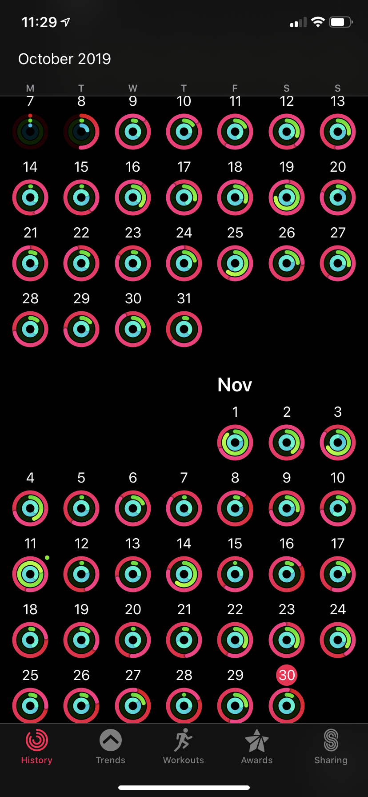

Ever since the Apple Watch came out, I have wanted one, but never had a reason to buy one. There was nothing about it that spoke to me enough to be willing to put up the money. Oh sure, it has some cool features and some “neat” things that would be fun to have. But I just saw it as another place to get notifications. And I’m sure you know that the last thing we need is _another_ place to get notifications. Am I right?

Then 2 months ago, I received an Apple Watch as a gift.

I can’t say “OH MY GOD IT CHANGED MY LIFE!”, although I’d love to be able to do that. I’m still growing into it and that the way I use it today will most likely not be the way I will use it tomorrow. I’m still learning what it can and can’t do and how to best fit it into my life.

The biggest thing that having the watch has done for me so far is to make me aware of my activity throughout the day. The activity rings are by far my most used feature. There is just something about seeing those rings close that’s compelling. As an attempt to “gamify” health, I really enjoy it.

As you can see in the image above, except for the first two days, I’ve made it a point to close the red move and blue stand rings. Up until now I haven’t much cared if I closed the green exercise ring.

But that changes this week.

Part of the purpose of my sabbatical is to start some healthy rhythms for my life. Some habits that I can continue and sustain as I move into 2020. One of the habits that I know I need is regular exercise. This is where I see the Apple Watch and the activity tracker becoming an integral part of my daily life. It already keeps me accountable to moving and standing during the day. Why not use it to help me track exercise as well?

So that’s what I’m going to do.

I started an exercise plan and I will track my workouts on the watch. As this sabbatical month goes by, I plan to start a habit that will stick with me long past the end of the year.

I want to say that I’m going to start out with a perfect week and that’s going to turn into a perfect month right from the start. But that’s pressure I’m not sure I’m ready to put on myself. I do want to make exercise a habit, but maybe that habit starts out as 3 days a week, not 7. I’m still figuring that part out. I do feel that once I start closing all 3 rings on a regular basis I will be very compelled to continue to do so.

So, while I don’t have any goals to have perfect weeks or months yet, who knows? Once you start a streak you don’t want it to break, right? So there could be a perfect week down the road. Then a perfect month.

Let's take this further. What if I could fill out all the rings for an entire year? If I made it a point to close all three rings every day for 12 full months, how much different would my life look then?

So then what happens if I take this concept and expand it. What if I gameified my life? What if I wrote every day for a year? What if I skipped out on the candy or pop for 12 months? What if I wrote a thank you note every day? How much more healthy and robust would my life be a year from now?

What about you? What would your life look like a year from now if you picked just one new healthy habit and did it every day?
