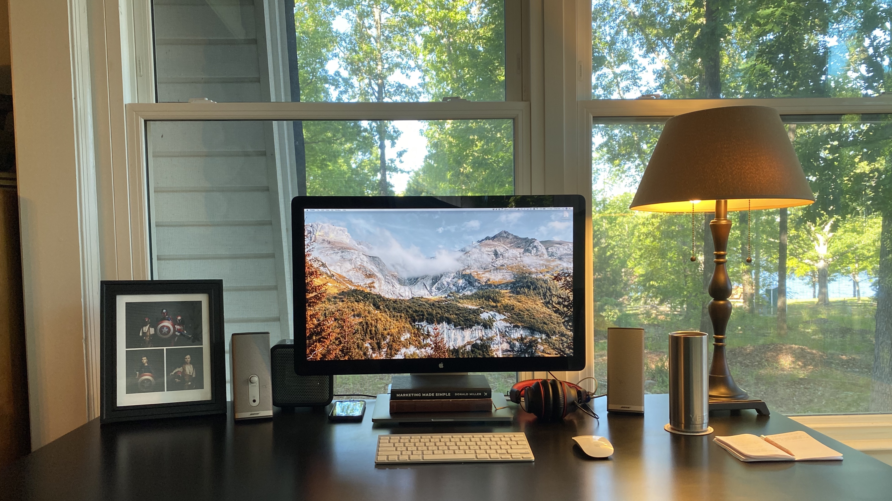

Have you ever dreamed of working from home?

I have. I’ve thought about it a lot over the years. What my ideal day would look like, how I would spend my time … you get the idea. I’ve even imagined in great detail what my office would look like.

There have been many variations of this “dream office” over the years.

- A huge office filled with dark wood, animal heads, a giant wall of bookshelves and a big, stately wood desk. I call it “The CEO”.
- A giant office filled with monitors, video game consoles, and all the techie gear you can think of. I like to call this one “The 64-bit”.
- A big room with a desk for work, a giant TV (and giant speakers) for watching all the things, with sports memorabilia along the walls. Obviously, this is dubbed “The Man Cave”.

I could go on, but you get the idea. I’ve really put big thought and effort into this. I’ve never had a job that allowed remote work, but I’ve dreamed about it a lot.

Now, because of the global pandemic we’re experiencing, I’ve been blessed with the opportunity to give it a go. I don’t have the giant office I’ve dreamed about (we just don’t have that kind of space in our home) but I’ve got a little corner in the front of the house that serves as my “office.” That’s the picture you see above.

It’s not much, and it surely doesn’t even come close to my dream scenarios, but I actually really dig it. It’s calm and peaceful. There are windows all around me. I can focus here.

## How Has Working From Home Been?

Two of the saddest days of my life were the days that I had to go back to work after my son and daughter were born. It broke my heart to know that I wouldn’t get to be there to see them do all the things that kids do for the first time because I had to be at an office in a chair to do a job that I could easily do from home. Granted, that was almost 20 years ago and the technology wasn’t what it is today. The internet wouldn’t have supported that plan. But the sense of loss I felt was still just as real.

I’ve been working from home for 6 weeks now and I absolutely love it.

Don’t get me wrong, I love my team at NewSpring and I really do want to see them all again but … I love my family even more. It’s been so great to be able to live and work and do all the daily things right by their side day after day.

For the past 6 weeks I’ve gotten to experience what it would have been like back then. And oh man, do I _love_ it.

The day that they tell us that we have to go back to the office again I think I might experience that same sense of loss that I felt all those years ago. Except this time I know that things _can_ be different.

I’m not sure what I’ll do with those emotions honestly. It’s going to take some time to process all of that. There are just so many benefits to working from home for me. The freedoms that remote work provides are huge.

## Benefits of Remote Work

It seems rather obvious at this point but getting to see my family more is the biggest benefit for me. But there are other things that stand out as perks too.

### A more flexible schedule.

Last Thursday I was able to go give blood in the middle of the day. I knew I could work a few hours later that day and/or over the weekend to make up the hours so taking a few hours in the afternoon to go do something good was amazing.

Granted, I know NewSpring would have let me go do it anyway (because they’re awesome), but so many employers just want their people in their seats for 8 hours a day. It’s about being in a chair not how productive you can be. Those people couldn’t go do things like this.

I know that if my family needs something at 1:30 on Tuesday that I can be with them and not think twice about it. If I’m getting my work done, it doesn’t matter when and where I do it.

### Shorter commute

I also get my commute time back. Working from home means that my commute is as quick as walking down the stairs from my bedroom to my desk. I live about 30 minutes from our office so every day without the commute gives me back an hour of my time.

I used to use that time to listen to podcasts … something I have yet to find time for in my new schedule … but now I get that time back for other things I’ve been wanting to do.

I could sleep in and get an extra hour if I wanted to. That’s a possible perk, right?

Personally, I’ve been getting up and exercising before work which is something that benefits my whole day.

Plus I have time to write daily if I want. A daily writing habit is something that I’ve wanted to create for a long time and I’m just now starting to put it in place.

A 30 minute workout and 30 minutes of writing time sure beats the heck out of driving to and from work every day.

Bonus: I’m saving a LOT of money in gas right now. I used to put gas in my car once a week. I haven’t even driven my car in the last 6 weeks. I know gas prices are cheaper because of the whole oil price thing, but at it’s previous price I’ve saved _at least_ \$180 just on gas for my car. Come on, that’s just too good.

### Casual dress

Every day is sweatpants day.

Haha. I know some people say that you should get up and get dressed every day like you’re going into the office anyway. It keeps your routine and gets you ready for the day. In the beginning I thought that was true for me. I wanted to not lose the rhythm of the office. I got up and put on the same clothes I would normally wear to work. I was proud. I thought I was doing this thing the right way.

Then one day I didn’t get up and get ready before work. I wore sweatpants instead of jeans. And you know what? My day didn’t fall apart. I was just as productive as I was when I got dressed for work. So it’s been sweatpants day every day since.

Now, it’s not like I’m a slob. I’ve been getting up and working out and taking a shower every day just like normal. I just don’t have to put on my “office clothes” to work.

I’m not even a little bit ashamed of it.

### Focused time

I get so much more focused work time than I did before.

When you work in an office, in particular an “open work environment” like I do, there are distractions everywhere. People are constantly talking around you. Because there are no barriers they also feel the freedom to come up and talk to you for any reason, no matter what you’re doing. I’ve even noticed that the international sign for focused work time (putting on headphones) doesn’t always help. The ease of access to individuals makes it extremely hard to get any real work done.

I’ve heard it said that every time you’re interrupted from being in focus mode (or, “the zone”, if you will) that it takes 30 minutes to get back to where you were when you were focused. If someone comes to chat or ask a question or buzzes you on Slack and you take the time to answer, you not only lose the time you are talking or Slack-ing, but you also lose an entire half hour of productive work time. All it takes is 8 small distractions and you’ve effectively lost an entire day.

We think we are a productive people because we sit in an office for 8 hours a day when that couldn’t be further from the truth. We are a distracted people who happen to sit in the same office with other distracted people every day.

I’ve found that I have been more productive since working from home than I ever have been in an office. Ever. I’ve had the opportunity to think deeper and have a clearer head while doing so than I ever have before.

## There Are More

These are just the biggest things that have been a benefit to me since I started working from home 6 weeks ago. There are others. For example:

- I’m eating healthier because I’m not “forgetting” to bring my lunch to work. Which you think would be saving us money but I think our grocery bill has gone up. 😂
- Meetings at work seem shorter. Everyone just gets through what we need to get through and then we’re done. There’s not the standing around and chatting … which, don’t get me wrong there is a place for, I’m sure. As an introvert though, I love it when there doesn’t have to be a ton of chit-chat for the sake of chit-chat.
- I can get a hug from my wife or kids just about any time I want or need one. Going around the house hugging my family at 3:30 in the afternoon might be the next routine I put in place. I like how that sounds!

Working from home has been a blessing for me in this season. I know a lot of people don’t have the ability to do that so they are just out of jobs right now. That’s sad and scary and I am praying for you. I know I am very blessed to work where I work and have the ability to do what I do. I’m extremely grateful that I get to do it from home right now. I am hoping that once everything return to “normal” that there will still be a possibility of doing the work from home thing at least some of the time. It can work, and it’s awesome.

P.S. Also, being able to go to the bathroom by yourself and not 5 or 6 other people at the same time … that’s reason enough for remote work right there. 😄
